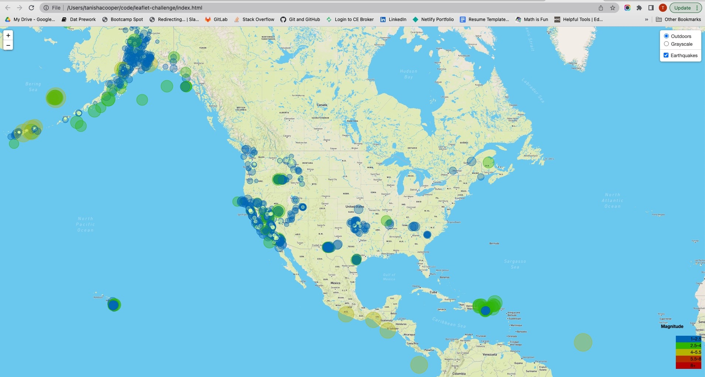

# leaflet-challenge

# Visualization of Earthquakes with Leaflet

## View Map
http://127.0.0.1:5500/index.html

# Part 1: Create the Earthquake Visualization

1. Dataset

2. Visual Data

# Part 2: Gather and Plot More Data